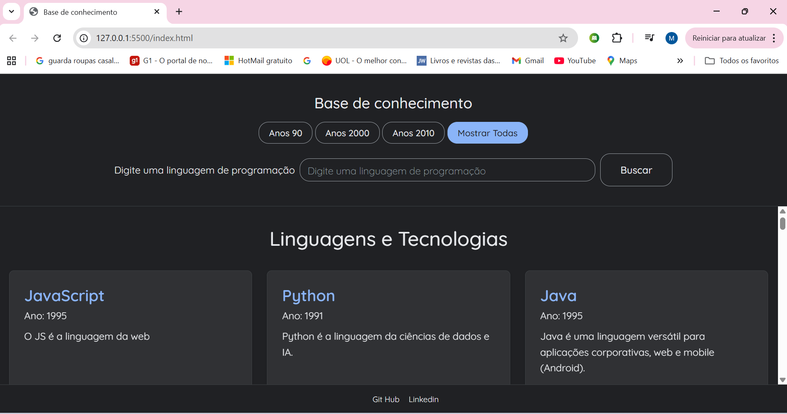

# Base de Conhecimento Tech



Uma aplicação web interativa e responsiva para explorar linguagens de programação e tecnologias. O projeto permite buscar e filtrar informações de forma rápida e intuitiva, apresentando os dados em um layout de cards moderno.

## ✨ Funcionalidades Principais

-   **Visualização em Cards:** Informações apresentadas em um layout de grade limpo e responsivo.
-   **Busca Dinâmica:** Filtre tecnologias por nome, descrição ou tags com resultados atualizados em tempo real, enquanto você digita.
-   **Filtro por Década:** Navegue por tecnologias criadas nos anos 90, 2000 e 2010.
-   **Filtros Combinados:** Una a busca por texto com o filtro de década para refinar ainda mais seus resultados.
-   **Design Responsivo:** Experiência de usuário otimizada para desktops, tablets e celulares.
-   **Carregamento de Dados Externo:** As informações são carregadas de forma assíncrona a partir de um arquivo `data.json`, facilitando a adição de novos conteúdos sem alterar o código.
-   **Acessibilidade:** Desenvolvido com práticas de acessibilidade, como atributos ARIA e semântica HTML, para garantir o uso por leitores de tela.

## 🚀 Tecnologias Utilizadas

Este projeto foi construído do zero utilizando tecnologias web fundamentais, com foco em código moderno e boas práticas:

-   **HTML5:** Estrutura semântica e acessível.
-   **CSS3:** Estilização moderna com Flexbox, Grid Layout, Variáveis CSS e Media Queries para responsividade.
-   **JavaScript (ES6+):** Lógica interativa, manipulação de DOM performática (`DocumentFragment`), `async/await` para requisições e modularização do código.

## ⚙️ Como Executar o Projeto

1.  Clone o repositório:
    ```bash
    git clone https://github.com/monicaevangelista/base-de-conhecimento.git
    ```
2.  Navegue até o diretório do projeto:
    ```bash
    cd base-de-conhecimento
    ```
3.  Abra o arquivo `index.html` em seu navegador de preferência.

    *Dica: Para uma melhor experiência de desenvolvimento, você pode usar uma extensão como o "Live Server" no VS Code, que atualiza a página automaticamente após qualquer alteração no código.*

## 📂 Estrutura do Projeto

```
/
├── index.html      # Estrutura principal da página
├── style.css       # Estilos visuais e layout
├── script.js       # Lógica de busca, filtros e renderização
├── data.json       # Base de dados com as informações das tecnologias
└── README.md       # Documentação do projeto
```

## ✒️ Autor

Desenvolvido por **Mônica Evangelista**.

-   LinkedIn https://www.linkedin.com/in/monicabevangelista/
-   GitHub https://github.com/monicaevangelista

---
